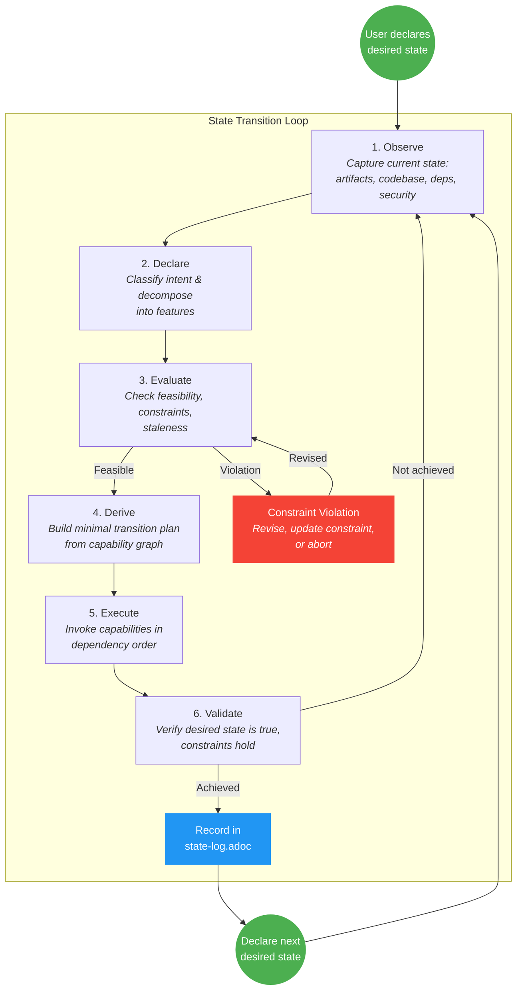
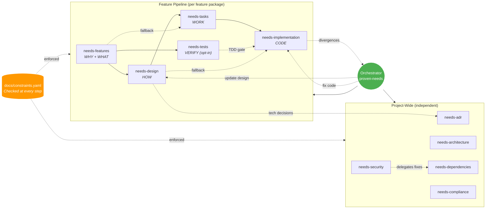
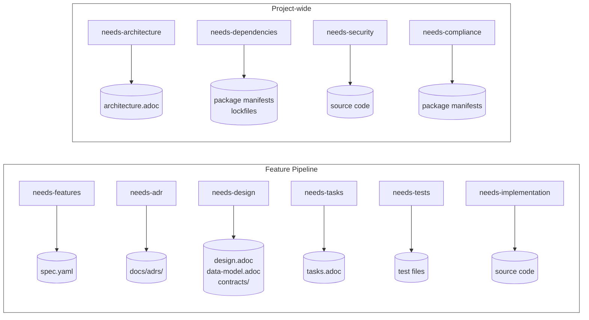
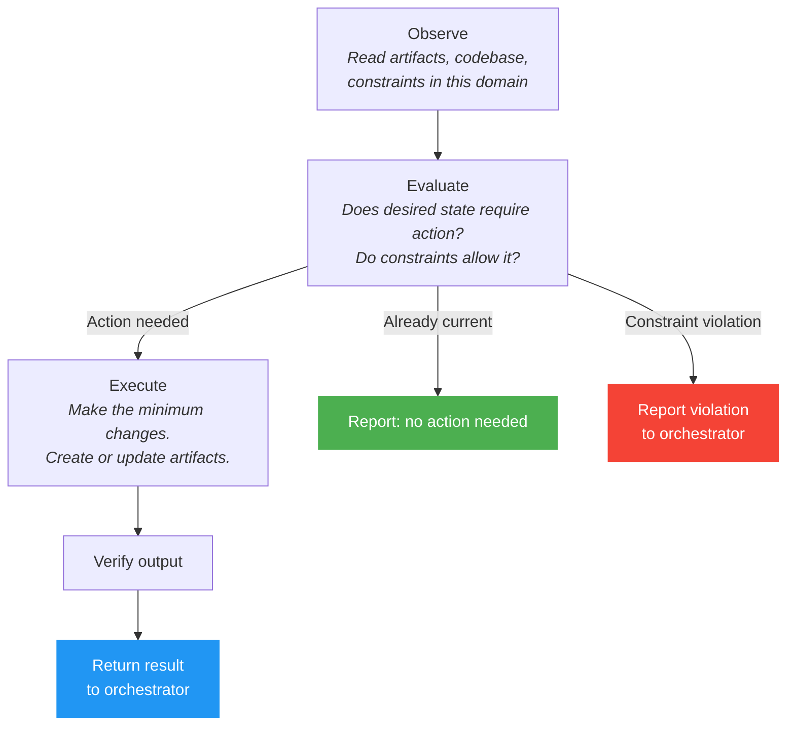
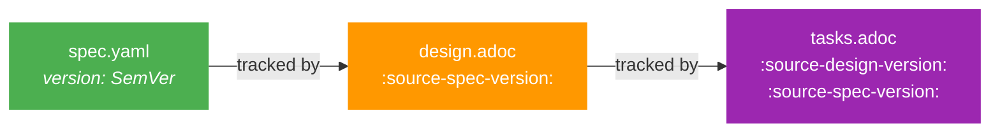

# proven-needs

Intent-driven state transition workflow for evolving software systems.

Declare a **desired state**, evaluate it against **reality** and **constraints**, then execute the **minimal valid transition** to make it true. Both feature work and maintenance use the same mechanism.

## How It Works



1. **Observe** current state (artifacts, codebase, dependencies, security posture)
2. **Declare** desired state ("Users can reset password via SMS", "No vulnerable dependencies")
3. **Evaluate** feasibility against constraints
4. **Derive** the minimal transition plan (which capabilities to invoke)
5. **Execute** the transition
6. **Validate** the desired state is now true

The system figures out what needs to happen. You declare what must be true.

### Capability Invocation

During the **Execute** phase, the orchestrator invokes capabilities in dependency order. The pipeline is not rigid -- the orchestrator derives what is needed dynamically and can skip steps whose artifacts are already current.



**Key relationships:**
- **Solid arrows** = primary dependency (required upstream artifact)
- **Dotted arrows** = optional or fallback paths
- `needs-features` is always invoked -- every feature gets a `spec.yaml` with user stories + EARS requirements
- `needs-design` requires `spec.yaml`
- `needs-tasks` prefers design but can derive tasks directly from `spec.yaml`
- `needs-tests` is opt-in (requires TDD ADR) -- derives executable tests from `spec.yaml`
- `needs-implementation` prefers tasks but can work requirement-by-requirement from design alone
- `needs-design` can trigger `needs-adr` creation for technology decisions

Independent features can be processed concurrently.

### Artifact Traceability

Each capability reads upstream artifacts and writes its own.

#### Artifact Ownership (writes)



| Capability | Reads | Writes |
|---|---|---|
| `needs-features` | `constraints.yaml` | `spec.yaml` |
| `needs-design` | `spec.yaml`, ADRs, `constraints.yaml`, `architecture.adoc` | `design.adoc`, `data-model.adoc`, `contracts/` |
| `needs-tasks` | `design.adoc` (or `spec.yaml` as fallback), `constraints.yaml` | `tasks.adoc` |
| `needs-tests` | `spec.yaml`, `design.adoc`, `constraints.yaml` | test files |
| `needs-implementation` | `tasks.adoc` (or `design.adoc` as fallback), `spec.yaml`, `constraints.yaml`, ADRs | source code |
| `needs-adr` | existing ADRs | `docs/adrs/*.yaml`, `index.yaml` |
| `needs-architecture` | all feature designs, ADRs, `docs/constraints.yaml`, codebase | `docs/architecture.adoc` |
| `needs-dependencies` | package manifests, `docs/constraints.yaml` | package manifests, lockfiles |
| `needs-security` | codebase, dependencies, config, `docs/constraints.yaml` | source code, config |
| `needs-compliance` | dependencies, `docs/constraints.yaml` | dependencies, `docs/constraints.yaml` |

## Entry Point

Load the `proven-needs` skill. It is the single orchestrator that accepts intents, classifies them, and invokes the appropriate capabilities.

```
I want users to be able to browse products, add them to cart, and checkout
```

The orchestrator will:
1. Decompose this into feature packages (product-browsing, shopping-cart, checkout)
2. Ask you to confirm the grouping
3. For each feature: create spec.yaml, design, plan tasks, implement
4. Resolve any design divergences (user decides: update design or fix code)
5. Record technology decisions as ADRs along the way
6. Update the architecture document when all features are implemented

## Core Concepts

### Desired State
A declarative statement of what must be true. Not a task list -- an intent.

- "Users can reset their password via SMS" (feature)
- "No dependencies have known vulnerabilities" (maintenance)
- "All API endpoints enforce rate limiting" (constraint)

### Constraints
Project-wide invariants that must not be violated. Defined in `docs/constraints.yaml`:

- License compliance rules
- Security policies
- Architecture boundaries
- Quality standards
- Performance SLAs

Cross-cutting requirements belong here, not in feature specs.

### Feature Packages
Self-contained units of work at `docs/features/<slug>/`:

```
docs/features/shopping-cart/
  spec.yaml            # WHY + WHAT: user stories + EARS requirements
  design.adoc          # HOW: implementation blueprint
  tasks.adoc           # WORK: phased task breakdown
```

The `spec.yaml` file combines user stories and EARS requirements in a single schema-validated artifact:

```yaml
feature: shopping-cart
prefix: CART
version: "1.0.0"
last_updated: "2026-02-20"

stories:
  - id: US-001
    title: Add to Cart
    narrative:
      as_a: shopper
      i_want: to add products to my cart
      so_that: I can purchase multiple items at once
    requirements:
      - id: CART-001
        text: >-
          When the user clicks the add-to-cart button on a product, the
          system shall add the product to the cart and update the cart count.
        ears_type: event-driven
        verification: >-
          Click add-to-cart. Confirm cart count increases by one.
```

- Each story has the user story narrative (As a / I want / So that)
- Requirements use EARS syntax and are directly under the story they resolve
- Every requirement has a unique ID, EARS type, and black-box verification
- The schema is enforced by `scripts/validate-specs.py`

Each feature is fully independent -- it can be specified, designed, and implemented without reading other features.

### Automated Testing (Opt-In)
Testing is opt-in, controlled by an ADR decision. When a project adopts TDD:
- The `needs-tests` capability derives tests from `spec.yaml` requirements
- Tests serve as the acceptance gate for implementation
- The orchestrator prompts for this decision on the first feature evolution intent

### State Log
Append-only audit trail at `docs/state-log.adoc` recording every transition: what was intended, what changed, what was verified.

## Capabilities

### Feature-Scoped (operate within a feature package)

| Capability | Skill | What it does |
|---|---|---|
| Features | `needs-features` | Create user stories + EARS requirements (spec.yaml) |
| Design | `needs-design` | Create implementation blueprint (HOW) |
| Tasks | `needs-tasks` | Break design into phased coding units |
| Tests | `needs-tests` | Derive executable tests from requirements (opt-in) |
| Implementation | `needs-implementation` | Write and verify code |

### Project-Wide (operate at the project level)

| Capability | Skill | What it does |
|---|---|---|
| ADRs | `needs-adr` | Record technology decisions |
| Architecture | `needs-architecture` | Document current system architecture |
| Dependencies | `needs-dependencies` | Manage and update dependency graph |
| Security | `needs-security` | Assess and remediate security posture |
| Compliance | `needs-compliance` | Verify license and policy compliance |

### Supporting Skills

| Skill | What it does |
|---|---|
| `ears-requirements` | EARS methodology reference for writing requirements |

Every capability follows the **observe/evaluate/execute** pattern:



## Artifact Lifecycle

| Artifact | Location | Lifecycle |
|---|---|---|
| Constraints | `docs/constraints.yaml` | Stable, changes rarely |
| Feature spec | `docs/features/<slug>/spec.yaml` | Living, schema-validated |
| Design | `docs/features/<slug>/design.adoc` | Living, synced with spec.yaml |
| Tasks | `docs/features/<slug>/tasks.adoc` | Ephemeral -- disposable once implementation verified |
| Tests | project test directories | Living (opt-in, requires TDD ADR) |
| ADRs | `docs/adrs/NNNN-title.yaml` | Permanent, append-only |
| Architecture | `docs/architecture.adoc` | Living, reflects current system |
| State Log | `docs/state-log.adoc` | Append-only audit trail |
| Code | project source | Living -- the actual system |

### Version Tracking and Staleness



When `spec.yaml` changes, the design may become stale. When the design changes, tasks become stale. The orchestrator detects these cascades during the Evaluate phase and includes sync steps in the transition plan.

## Validation

All structured artifacts (feature specs, constraints, ADRs) are machine-validated with JSON schemas and consistency scripts:

| Artifact | Schema | Validation Script |
|---|---|---|
| Feature specs | `skills/needs-features/schemas/feature-spec.schema.json` | `scripts/validate-specs.py` |
| Constraints | `skills/proven-needs/schemas/constraints.schema.json` | `scripts/validate-constraints.py` |
| ADRs | `skills/needs-adr/schemas/adr.schema.json` + `adr-index.schema.json` | `scripts/validate-adrs.py` |

```
python scripts/validate-specs.py docs/features/*/spec.yaml
python scripts/validate-constraints.py docs/constraints.yaml
python scripts/validate-adrs.py docs/adrs/
```

## Risk Classification

Transitions are auto-approved or require confirmation based on risk:

| Risk | Auto-approve? | Examples |
|---|---|---|
| **Low** | Yes | Patch dependency updates, metadata fixes |
| **Medium** | Propose, ask | Minor dependency updates, design syncs |
| **High** | Full plan, require approval | New features, architecture changes, code changes |

## What This Is Not

- **Not waterfall** -- the desired state is disposable; declare a new one each iteration
- **Not backlog-driven** -- work is derived each iteration, not accumulated in a backlog
- **Not uncontrolled** -- constraints anchor behavior and prevent regressions

## Reference

- [Example Session](skills/proven-needs/references/example-session.adoc) -- Full walkthrough of feature and maintenance intents
