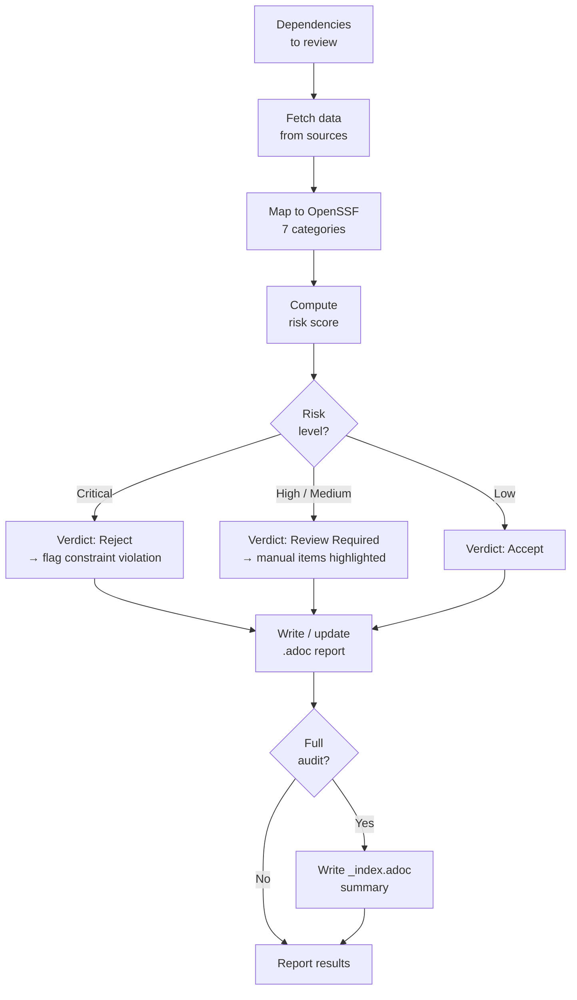

## Purpose

Every dependency you add is code you didn't write running in your system. A compromised or abandoned package can become an attack vector, a maintenance burden, or a licensing liability. This skill applies the [OpenSSF Concise Guide for Evaluating Open Source Software](https://best.openssf.org/Concise-Guide-for-Evaluating-Open-Source-Software) systematically so that dependency decisions are informed, documented, and auditable.

## Prerequisites

This skill is invoked by the `proven-needs` orchestrator, which provides the desired state and current state context. It can also be invoked directly when a user asks to evaluate a specific dependency.

**Invocation modes:**

| Mode | Trigger | Scope |
|---|---|---|
| **Single review** | User names a specific package, or orchestrator flags a new dependency | One package |
| **Full audit** | User asks for a project-wide supply chain review | All direct dependencies |
| **Staleness check** | Orchestrator detects reviews older than the staleness threshold | Stale-reviewed packages |

## Observe

Assess the current state of supply chain reviews for the project's dependencies.

### 1. Determine review mode

Identify whether this is a single-dependency review, a full audit, or a staleness re-review based on the orchestrator's context or the user's request.

### 2. Detect dependencies

Read the project's dependency manifest(s) to identify direct dependencies. The skill is ecosystem-agnostic -- use whatever manifest is present:

| File | Ecosystem |
|---|---|
| `package.json` | npm / Node.js |
| `Cargo.toml` | Rust / Cargo |
| `go.mod` | Go modules |
| `pyproject.toml` / `requirements.txt` | Python / pip / poetry / uv |
| `Gemfile` | Ruby / Bundler |
| `pom.xml` / `build.gradle` | Java / Maven / Gradle |
| `*.csproj` | .NET / NuGet |

For **single review** mode, only the target package matters. For **full audit**, enumerate all direct production dependencies (skip dev-only dependencies unless the user explicitly includes them).

### 3. Read existing reviews

Check `docs/supply-reviews/` for existing review files. For each:
- Read `:last-reviewed:` date
- Read `:package-version:` to detect version drift (current installed version differs from reviewed version)
- Read `:verdict:` for current status

If `docs/supply-reviews/` does not exist yet, note that no prior reviews exist. The Execute phase will create the directory when writing the first report.

### 4. Read constraints

Read `docs/constraints.adoc`. Look for:
- **Supply chain constraints** (e.g., "All direct dependencies must have a current supply review")
- **Security constraints** (e.g., "No dependency with a known CRITICAL or HIGH CVE")
- **Licensing constraints** (e.g., "Only MIT, Apache-2.0, and BSD-licensed dependencies are permitted")
- **Staleness threshold** -- if a constraint specifies a review freshness period, use it. Otherwise default to 180 days.

If `docs/constraints.adoc` does not exist, note that no project constraints are defined. The review still proceeds -- constraints provide additional context but are not required. In the report's Constraint Compliance section, note `No constraints defined` and recommend the user consider establishing supply chain, licensing, and security constraints.

### 5. Report observation

Return to the orchestrator:

```
Supply reviews:
  total-direct-dependencies: N
  reviewed: N (current: N, stale: N, version-drifted: N)
  unreviewed: N
  verdicts: {accept: N, review-required: N, reject: N}
Staleness threshold: N days
Constraint violations:
  - [list of violated supply chain / licensing / security constraints]
Dependencies needing review:
  - [list with reason: unreviewed / stale / version-drifted / explicitly-requested]
```

## Evaluate

Given the desired state from the orchestrator, determine which dependencies need review and what data to gather.

### 1. Determine review list

| Condition | Action |
|---|---|
| Single review requested | Review the named package |
| Full audit requested | Review all unreviewed + stale + version-drifted dependencies |
| Staleness check | Review only stale and version-drifted dependencies |
| New dependency detected | Review the new package before it is accepted |

### 2. Gather data for each dependency

For each dependency on the review list, fetch data from available sources. Not every source will be reachable for every package -- gather what you can and mark gaps.

**Automated data sources:**

| Source | Data Points | Method |
|---|---|---|
| Package registry (npm, PyPI, crates.io, etc.) | Version, license, description, publish dates, maintainer count, weekly downloads | Web fetch to registry API |
| GitHub / GitLab repository | Stars, forks, open issues, contributors, last commit, recent commit frequency, SECURITY.md presence, branch protection | Web fetch to repo page or API |
| [deps.dev](https://deps.dev/) | OpenSSF Scorecard score, known vulnerabilities (via OSV), dependency count, dependent count | Web fetch |
| [bestpractices.dev](https://www.bestpractices.dev/) | OpenSSF Best Practices badge status and level | Web fetch |

**Recommended API endpoints:**

Use these specific endpoints rather than scraping web pages -- they return structured data and avoid JavaScript-rendered content:

| Source | Endpoint Pattern | Notes |
|---|---|---|
| npm registry | `https://registry.npmjs.org/<package>/<version>` | Use the single-version endpoint to avoid huge responses. For download counts: `https://api.npmjs.org/downloads/point/last-week/<package>` |
| PyPI | `https://pypi.org/pypi/<package>/json` | Includes version history, license, maintainers |
| deps.dev API | `https://api.deps.dev/v3alpha/systems/<system>/packages/<package>/versions/<version>` | Systems: `npm`, `pypi`, `cargo`, `go`, `maven`. Returns scorecard, advisories, dependencies. Also useful: `https://api.deps.dev/v3alpha/advisories/<advisory-id>` for full advisory details |
| bestpractices.dev | `https://www.bestpractices.dev/en/projects.json?q=<package-name>` | Returns JSON array. Filter results carefully -- the search is fuzzy and may return unrelated projects. Match on repository URL, not just name. |
| GitHub API | `https://api.github.com/repos/<owner>/<repo>` | Rate-limited but no auth required for basic metadata. For security policy: check if `SECURITY.md` exists at repo root. |
| OSV | OSV's query API requires POST requests, which may not be available via web fetch. Use deps.dev's `advisoryKeys` field as the primary vulnerability source instead. If deps.dev data is unavailable, check `https://osv.dev/vulnerability/<id>` for known advisory IDs. |

**Fetching strategy:**

Fetch in parallel where possible. For each package:

1. Determine the source repository URL from the package registry metadata
2. Fetch registry metadata (version history, license, maintainers, downloads)
3. Fetch repository data (activity, contributors, security policy)
4. Fetch deps.dev data (scorecard, vulnerabilities, dependency graph)
5. Fetch bestpractices.dev badge status

If a fetch fails or a data source isn't available for this ecosystem, note the gap in the report rather than blocking the review. A review with partial data is better than no review.

### 3. Map data to OpenSSF evaluation categories

The OpenSSF guide organizes evaluation into 7 categories. Each category contains rules that are either **automatable** (data can be fetched and assessed programmatically) or **manual** (requires human judgment). The skill fills in automatable items and marks manual items as `Pending Review`.

**When to fill in manual items:** Some items marked "manual" can be conclusively assessed from publicly available evidence -- for example, a package with a documented history of malicious code injection clearly fails the "Malicious Code Check" without needing hands-on testing. Fill in manual items with a verdict and evidence when the facts are well-documented and unambiguous. Reserve `Pending Review` for items that genuinely require hands-on testing, subjective design judgment, or project-specific context that can't be determined from public data.

**Category 1: Initial Assessment**

| Rule | Auto? | Data Source | Pass Criteria |
|---|---|---|---|
| Consider Necessity | No | Human judgment | Developer documents why the dependency is needed vs. writing the functionality |
| Verify Authenticity | Partial | Registry + repo | Package name is not suspiciously similar to a more popular package; package links to its claimed repo; repo is not a personal fork of the real project; creation date is not suspiciously recent |

**Category 2: Maintenance & Sustainability**

| Rule | Auto? | Data Source | Pass Criteria |
|---|---|---|---|
| Activity Level | Yes | Repository | Commits within last 12 months |
| Communication | Yes | Registry + repo | Release notes or announcements within last 12 months |
| Maintainer Diversity | Yes | Registry + repo | More than 1 maintainer, ideally from different organizations |
| Release Recency | Yes | Registry | Last release within 12 months |
| Version Stability | Yes | Registry | Version >= 1.0.0, no alpha/beta/rc tags in the installed version |

**Category 3: Security Practices**

| Rule | Auto? | Data Source | Pass Criteria |
|---|---|---|---|
| Best Practices Badge | Yes | bestpractices.dev | Badge earned or in progress |
| Dependency Management | Yes | deps.dev + registry | Dependencies are not significantly outdated |
| Security Audits | Partial | OpenSSF security reviews list | Check if a public audit exists |
| Security Scores | Yes | deps.dev | OpenSSF Scorecard >= 5/10, no known HIGH/CRITICAL vulnerabilities |
| Testing Practices | Partial | Scorecard (CI-Tests check) | CI pipeline exists with automated tests |
| Vulnerability Status | Yes | deps.dev / OSV | No known HIGH or CRITICAL vulnerabilities in the current version |
| Repository Security | Partial | Scorecard (Branch-Protection) | Branch protection enabled |
| Security Response | No | Human judgment | Project fixes security bugs promptly, offers LTS if applicable |
| Security Documentation | No | Human judgment | Assurance case or security design documentation exists |
| Security Development | Partial | Scorecard | Evidence of secure development practices per OpenSSF Scorecard checks |

**Category 4: Usability & Security**

| Rule | Auto? | Data Source | Pass Criteria |
|---|---|---|---|
| Interface Design | No | Human judgment | API is designed for secure use (parameterized queries, etc.) |
| Interface Stability | Partial | Registry | No breaking changes in recent minor releases; semver adherence |
| Secure Defaults | No | Human judgment | Default config is secure (encryption on, etc.) |
| Security Guidance | Partial | Repository | SECURITY.md or security documentation exists |
| Vulnerability Reporting | Partial | Repository | SECURITY.md with reporting instructions, or security advisories enabled |

**Category 5: Adoption & Licensing**

| Rule | Auto? | Data Source | Pass Criteria |
|---|---|---|---|
| License Clarity | Yes | Registry + repo | Has a license; license is a recognized OSI license; consistent with project constraints |
| Name Verification | Partial | Registry | No more-popular package with a confusingly similar name |
| Adoption | Yes | Registry + deps.dev | Significant download count and/or dependent count for the ecosystem |
| Suitability | No | Human judgment | Package is a good fit for the problem, not chosen out of hype |

**Category 6: Practical Testing**

| Rule | Auto? | Data Source | Pass Criteria |
|---|---|---|---|
| Behavior Testing | No | Human judgment | Tested in isolated environment; no malicious behavior observed |
| Dependency Impact | Partial | Package manager | Number of transitive production dependencies added is reasonable |

**Category 7: Code Evaluation**

| Rule | Auto? | Data Source | Pass Criteria |
|---|---|---|---|
| Code Completeness | No | Human judgment | No excessive TODOs or incomplete implementations |
| Malicious Code Check | No | Human judgment | No evidence of data exfiltration, obfuscated execution, suspicious install scripts |
| Security Implementations | No | Human judgment | Evidence of input validation, parameterized queries, secure coding |
| Security Reviews | Partial | OpenSSF security reviews | Check published review list |
| Static Analysis | No | Human judgment | Top static analysis findings reviewed |
| Sandbox Testing | No | Human judgment | Ran in sandbox to detect malicious behavior |
| Test Validation | No | Human judgment | Test suite passes |

### 4. Compute risk score

Each dependency receives a risk level based on a weighted assessment across the 7 categories. Security Practices and Maintenance carry the most weight because an unmaintained or insecure dependency is the most likely to cause real problems.

**Per-category scoring (0-10 scale):**

Score each category on a 0-10 scale based on its constituent rules:

1. For each rule in the category, assign: **Pass = 10**, **Warn = 5**, **Fail = 0**, **Pending Review = 5** (neutral -- don't penalize for items that require human judgment, but don't give full credit either), **Unavailable = 5** (data gap, not a failing)
2. Average the rule scores within the category to get the category score
3. Show the calculation in the Score Breakdown table so the verdict is transparent and reproducible

**Category pass thresholds:** A category "scores poorly" if its score is below 5/10.

**Scoring weights:**

| Category | Weight | Rationale |
|---|---|---|
| Security Practices | 30% | Direct security impact -- vulnerabilities, scorecard, testing |
| Maintenance & Sustainability | 25% | Unmaintained software is a ticking time bomb |
| Adoption & Licensing | 15% | License violations have legal consequences; low adoption means less scrutiny |
| Initial Assessment | 10% | Authenticity and necessity are gatekeepers |
| Usability & Security | 10% | Insecure defaults and poor APIs lead to misuse |
| Practical Testing | 5% | Important but often deferred to implementation time |
| Code Evaluation | 5% | Important but labor-intensive; covered partially by Scorecard |

**Weighted overall score:** Multiply each category score by its weight, sum them. The result is a 0-10 score.

**Risk level thresholds:**

| Risk Level | Weighted Score | Condition | Verdict |
|---|---|---|---|
| **Critical** | Any | Any known HIGH/CRITICAL CVE in current version, OR strong indicators of malicious/compromised package, OR no license | **Reject** |
| **High** | < 4.0 | No commits in >12 months AND no release in >12 months, OR OpenSSF Scorecard < 3, OR single maintainer with no org backing AND pre-1.0 | **Review Required** |
| **Medium** | 4.0 - 6.0 | Last release 6-12 months ago, OR pre-1.0 version, OR Scorecard 3-5, OR license not in project's allowed list | **Review Required** |
| **Low** | > 6.0 | Active maintenance, clear OSI license matching constraints, Scorecard > 5, no known vulnerabilities, healthy adoption | **Accept** |

**Override rules:**
- A single Critical finding in any category overrides the weighted score to Critical
- A known HIGH/CRITICAL CVE always results in Critical regardless of other scores
- If >=3 categories score poorly (below 5/10), bump the risk level up by one tier

**Historically compromised packages:**

Some packages have a history of deliberate supply chain attacks (e.g., maintainer-inserted malware, protestware) where the malicious code has been removed in later versions but the same maintainer retains control. These are a special case: the *current* version may have no active CVEs, but the trust relationship is broken.

When evaluating such packages:
- The "strong indicators of malicious/compromised package" clause applies even if no *current* CVE exists -- a confirmed history of deliberate maintainer-initiated supply chain attacks is itself a Critical indicator
- Check whether the maintainer who inserted the malicious code still controls the repository and/or npm publishing rights. If yes, the risk of recurrence is non-trivial.
- Check whether the community has migrated away (look at dependent count trends across versions)
- Fill in normally-manual items (Security Response, Malicious Code Check, Suitability) when publicly available evidence is conclusive -- do not leave these as "Pending Review" if the facts are well-documented. Reserve "Pending Review" for items that genuinely require hands-on testing or subjective judgment.

### 5. Check constraints

- Would accepting this dependency violate any licensing constraint?
- Would it violate any security constraint (known vulnerabilities)?
- Does a supply chain constraint require review before acceptance?

### 6. Report evaluation

Return to the orchestrator:

```
Action: review / re-review / audit / none
Dependencies to review: [{package, version, reason, preliminary-risk}]
Data completeness: {auto-populated: N%, manual-pending: N%}
Constraint implications: [which constraints are affected]
```

## Execute



### 1. Write individual review reports

For each reviewed dependency, create or update `docs/supply-reviews/<package-name>.adoc` using the report template below.

**When updating an existing review:**
- Preserve any manual review entries the user has already filled in (sections marked with user-provided content rather than `Pending Review`)
- Update all auto-populated sections with fresh data
- Update `:last-reviewed:`, `:package-version:`, and `:risk-level:`
- If the verdict changed, add a note in the Summary explaining why

**Report template:**

```asciidoc
= Supply Review: <package-name>
:version: 1.0.0
:last-reviewed: YYYY-MM-DD
:risk-level: Low | Medium | High | Critical
:verdict: Accept | Review Required | Reject
:package-version: x.y.z
:ecosystem: npm | pypi | cargo | go | maven | bundler | nuget
:source-url: <repository URL>
:registry-url: <package registry URL>

== Summary

<One-paragraph executive summary. State the risk level, the verdict, key findings
that drive the verdict, and the recommended action. Be specific about what makes
this dependency safe or risky. If the package is unsuitable for the user's stated
purpose (e.g., it's a viewer not a generator, or it solves a different problem),
surface this prominently here -- suitability mismatches are the most important
finding because they make the rest of the review moot.>

== Initial Assessment

=== Necessity
// [manual] Why is this dependency needed? What would the alternative be?
Status:: Pending Review

=== Authenticity
// [auto] Package identity verification
Status:: <Pass | Warn | Fail>
Registry name:: <package name>
Source repository:: <URL>
Created:: <date>
Downloads (weekly):: <count>
Similar names:: <list any suspiciously similar more-popular packages, or "none found">

== Maintenance & Sustainability

=== Activity Level
// [auto] Recent development activity
Status:: <Pass | Warn | Fail>
Last commit:: <date>
Commits (12 months):: <count>

=== Communication
// [auto] Project communication and releases
Status:: <Pass | Warn | Fail>
Last release:: <version> (<date>)
Release notes:: <Present | Missing>

=== Maintainer Diversity
// [auto] Bus factor assessment
Status:: <Pass | Warn | Fail>
Maintainers:: <count>
Organizations:: <list or "unknown">

=== Release Recency
// [auto] How recently was the last release?
Status:: <Pass | Warn | Fail>
Last release date:: <date>
Days since release:: <N>

=== Version Stability
// [auto] Is the version string stable?
Status:: <Pass | Warn | Fail>
Current version:: <version>
Pre-release:: <Yes (alpha/beta/rc) | No>

== Security Practices

=== OpenSSF Scorecard
// [auto] Scorecard from deps.dev
Status:: <Pass (>= 5) | Warn (3-5) | Fail (< 3) | Unavailable>
Score:: <N/10 or "not available">
Key checks:: <list notable pass/fail checks>

=== Best Practices Badge
// [auto] OpenSSF Best Practices badge
Status:: <Pass | Warn | Fail | Unavailable>
Level:: <None | In Progress | Passing | Silver | Gold>

=== Known Vulnerabilities
// [auto] Current vulnerability status
Status:: <Pass | Warn | Fail>
Advisories:: <list CVEs with severity, or "none known">

=== Vulnerability Reporting
// [auto] Can vulnerabilities be reported?
Status:: <Pass | Warn | Fail>
SECURITY.md:: <Present | Missing>
Security advisories:: <Enabled | Disabled | Unknown>

=== Dependency Management
// [auto] Are the package's own dependencies current?
Status:: <Pass | Warn | Fail>
Outdated dependencies:: <count or "unknown">

=== Testing Practices
// [auto/partial] CI and test evidence
Status:: <Pass | Warn | Fail | Unknown>
CI pipeline:: <Detected | Not detected>
Scorecard CI-Tests:: <pass | fail | unknown>

=== Repository Security
// [auto/partial] Repository protection
Status:: <Pass | Warn | Fail | Unknown>
Branch protection:: <Enabled | Not detected | Unknown>

=== Security Response
// [manual] How does the project handle security issues?
Status:: Pending Review

=== Security Documentation
// [manual] Is there an assurance case or security design doc?
Status:: Pending Review

== Usability & Security

=== Interface Stability
// [auto/partial] API stability signals
Status:: <Pass | Warn | Fail>
Semver adherence:: <Yes | No | Unknown>
Breaking changes in recent releases:: <Yes | No | Unknown>

=== Secure Defaults
// [manual] Are default configurations secure?
Status:: Pending Review

=== Security Guidance
// [manual] Is there documentation on secure usage?
Status:: Pending Review

=== Interface Design
// [manual] Is the API designed for secure use?
Status:: Pending Review

== Adoption & Licensing

=== License
// [auto] License verification
Status:: <Pass | Warn | Fail>
License:: <SPDX identifier>
OSI approved:: <Yes | No>
Constraint compliant:: <Yes | No | No constraint defined>

=== Adoption Level
// [auto] Usage indicators
Status:: <Pass | Warn | Fail>
Weekly downloads:: <count>
Dependents:: <count or "unknown">
GitHub stars:: <count>

=== Name Verification
// [auto] Typosquatting check
Status:: <Pass | Warn>
Similar packages:: <list or "none found">

=== Suitability
// [manual] Is this the right tool for the job?
Status:: Pending Review

== Practical Testing

=== Behavior Testing
// [manual] Tested in isolated environment?
Status:: Pending Review

=== Dependency Impact
// [auto/partial] What does this dependency pull in?
Status:: <Pass | Warn | Fail>
Direct transitive dependencies:: <count>
Total transitive dependencies:: <count or "unknown">
Notable transitive dependencies:: <list any with known issues>

== Code Evaluation

=== Malicious Code Check
// [manual] Any evidence of malicious intent?
Status:: Pending Review

=== Code Completeness
// [manual] Evidence of incomplete or insecure code?
Status:: Pending Review

=== Security Implementations
// [manual] Evidence of secure coding practices?
Status:: Pending Review

=== Security Reviews
// [auto/partial] Published security reviews
Status:: <Pass | Warn | Unavailable>
Published reviews:: <list URLs or "none found">

=== Static Analysis
// [manual] Static analysis findings
Status:: Pending Review

=== Sandbox Testing
// [manual] Ran in sandbox?
Status:: Pending Review

=== Test Validation
// [manual] Test suite passes?
Status:: Pending Review

== Risk Assessment

=== Score Breakdown

[cols="3,1,1,4"]
|===
| Category | Weight | Score | Notes

| Security Practices
| 30%
| <score>
| <key factors>

| Maintenance & Sustainability
| 25%
| <score>
| <key factors>

| Adoption & Licensing
| 15%
| <score>
| <key factors>

| Initial Assessment
| 10%
| <score>
| <key factors>

| Usability & Security
| 10%
| <score>
| <key factors>

| Practical Testing
| 5%
| <score>
| <key factors>

| Code Evaluation
| 5%
| <score>
| <key factors>

| **Overall**
| **100%**
| **<weighted score>**
| **Risk: <level>**
|===

=== Overrides

<List any override rules that applied, e.g., "Critical CVE detected -- risk elevated to Critical regardless of weighted score." Or "No overrides applied.">

== Recommendations

<Numbered list of specific actions. Examples:>
<1. Accept for use -- no blocking issues found.>
<2. Monitor CVE-XXXX-YYYYY -- medium severity, patch expected soon.>
<3. Complete manual review sections before production deployment.>

== Constraint Compliance

[cols="2,1,2"]
|===
| Constraint | Status | Detail

| <constraint text>
| <Pass / Fail>
| <explanation>
|===

== CI Data
// Machine-readable block for automation pipelines

[source,json]
----
{
  "package": "<name>",
  "version": "<version>",
  "ecosystem": "<ecosystem>",
  "risk_level": "<low|medium|high|critical>",
  "verdict": "<accept|review_required|reject>",
  "scorecard": <score or null>,
  "known_vulnerabilities": <count>,
  "license": "<SPDX>",
  "license_compliant": <true|false|null>,
  "maintainers": <count>,
  "last_commit_days_ago": <N>,
  "last_release_days_ago": <N>,
  "manual_checks_pending": <N>,
  "manual_checks_completed": <N>,
  "last_reviewed": "<YYYY-MM-DD>",
  "constraint_violations": [<list>],
  "review_type": "<new|updated|stale_refresh|version_drift>",
  "previous_version": "<version or null>",
  "previous_verdict": "<verdict or null>"
}
----
```

The `review_type` field tells CI pipelines whether this is a first review, an update, or a response to staleness/drift. The `previous_version` and `previous_verdict` fields help track how the assessment changed over time.

### 2. Write audit index (full audit mode only)

When running a full audit, create or update `docs/supply-reviews/_index.adoc`:

```asciidoc
= Supply Chain Review Index
:last-updated: YYYY-MM-DD
:total-dependencies: N
:reviewed: N
:unreviewed: N

== Summary

<Brief overview of the project's supply chain health. Highlight critical findings
and overall risk posture.>

== Dependency Risk Overview

[cols="3,1,1,1,1,2"]
|===
| Package | Version | Risk | Verdict | Last Reviewed | Key Finding

| <package>
| <version>
| <risk-level>
| <verdict>
| <date>
| <one-line summary>

|===

== Risk Distribution

* Critical: N
* High: N
* Medium: N
* Low: N
* Unreviewed: N

== Constraint Compliance Summary

* Supply chain constraints: <N pass / N fail>
* Licensing constraints: <N pass / N fail>
* Security constraints: <N pass / N fail>

== CI Data

[source,json]
----
{
  "audit_date": "<YYYY-MM-DD>",
  "total_dependencies": <N>,
  "reviewed": <N>,
  "unreviewed": <N>,
  "risk_distribution": {
    "critical": <N>,
    "high": <N>,
    "medium": <N>,
    "low": <N>
  },
  "verdict_distribution": {
    "accept": <N>,
    "review_required": <N>,
    "reject": <N>
  },
  "constraint_violations": <N>,
  "manual_checks_pending": <N>,
  "blocking": <true if any critical/reject>
}
----
```

### 3. Staleness and version drift handling

When updating a review because the installed version has changed:
- If the update is a **patch** version bump: keep the existing review, update `:package-version:` and `:last-reviewed:`, re-fetch auto-populated data, preserve manual entries. Note the version change in the Summary.
- If the update is a **minor** version bump: same as patch, but add a note flagging potential API changes for the manual Usability & Security sections.
- If the update is a **major** version bump: treat as a new review. Preserve manual entries as reference (under a collapsed "Previous Review" section) but reset their status to `Pending Review` since the major version may have fundamentally changed the package.

### 4. Verify

After all reports are written:
1. Confirm each `.adoc` file was created/updated in `docs/supply-reviews/`
2. Confirm the index was updated (if full audit)
3. List any constraint violations that remain unresolved
4. List manual review items that are still pending

### 5. Report results

Return to the orchestrator:

```
Reviews completed: [{package, version, risk-level, verdict, status: new/updated}]
Index updated: yes/no
Constraint violations: [list or none]
Manual reviews pending: N items across M packages
Blocking issues: [any Critical/Reject findings]
```

## Quality Checklist

Before finalizing, verify:

- [ ] Every reviewed dependency has all 7 OpenSSF categories addressed
- [ ] Auto-fetched data includes source citations (URLs, dates accessed)
- [ ] Manual review items are either filled in (when public evidence is conclusive) or marked `Pending Review` with guidance on what to assess
- [ ] Risk score is computed with breakdown showing how the verdict was derived
- [ ] Constraint violations are surfaced with specific constraint text
- [ ] CI Data block contains valid JSON with all required fields
- [ ] Existing manual entries in updated reviews are preserved (not overwritten)
- [ ] The `_index.adoc` reflects the current state of all reviews (if full audit)

## Reference

See `references/example.adoc` for a complete example showing a supply review of the `stripe` package in an e-commerce project context.
